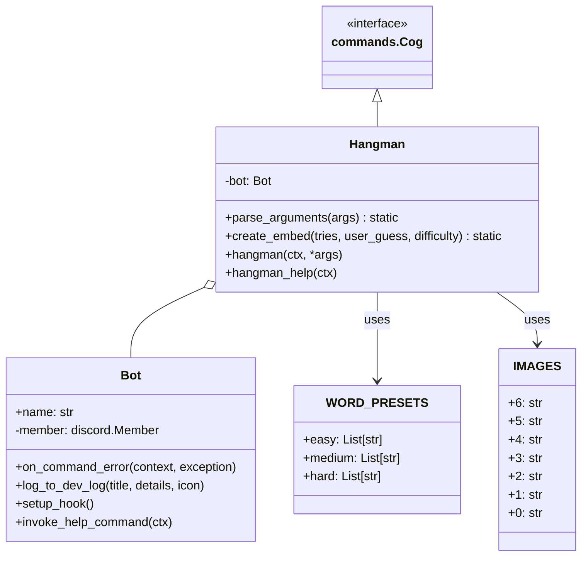

# Report for assignment 4

This is a template for your report. You are free to modify it as needed.
It is not required to use markdown for your report either, but the report
has to be delivered in a standard, cross-platform format.

## Project

Name: sir-lancebot

URL: https://github.com/e-basaran/sir-lancebot-hangman-update.git

A Discord bot for many stuff, like playing games. We focused on hangman game.

## Onboarding experience

We chose a new project, because we didn't have much experience with deep learning.

It was a bit easier. For some of us, there were some version conflicts with the packages, but overall it was straightforward.
Another thing that slowed us was the tokens, but we managed to build the project successfully.

## Effort spent

For each team member, how much time was spent in

Eyüp: I mostly dealt with argumnt parsing logic, setting up the project, and connecting the components.

1. plenary discussions/meetings: 5-6 hours (0.5h every day online meeting to divide works and fix bugs)

2. discussions within parts of the group: 2 hours

3. reading documentation: 1 hour

4. configuration and setup: 2 hours. I didn't have package conflicts, but understanding the tokens, and setting them slowed me a bit.

5. analyzing code/output: 3 hours

6. writing documentation: 2 hour

7. writing code: 4 hours

8. running code: 2 hour

Bingjie:

1. plenary discussions/meetings: 5-6 hours (0.5h every day online meeting to divide works and fix bugs)

2. discussions within parts of the group: 3 hours

3. reading documentation: 1 hour

4. configuration and setup: 4 hours.

5. analyzing code/output: 4 hours

6. writing code: 4 hours

7. running code: 2 hour

Melissa:

1. plenary discussions/meetings: 5-6 hours (0.5h every day online meeting to divide works and fix bugs)

2. discussions within parts of the group: 2hour

3. reading documentation: 1 hour

4. configuration and setup: 3 hours. I needed to redo the setup because of the tokens were wrong. Also at the start it took time to understand how to export the tokens in an .env or with export in terminal.

5. writing code for defficulty presets/understanding how to define: 2 hours

6. Writing/understanding test cases: 3 hours

7. writing documentation: 1 hour

8. running code: 1 hour

Ismail:

1. plenary discussions/meetings: 5-6 hours (0.5h every day online meeting to divide work and fix bugs)

2. discussions within parts of the group: 2 hours

3. reading documentation: 1 hour

4. configuration and setup: 6 hours. Initially, I tried setting up on Linux Ubuntu, but I ran into multiple errors, including package version conflicts and an issue where Poetry wouldn't install due to an unknown reason. After spending a lot of time troubleshooting, I switched to Windows, where the setup went smoothly. From there, I only had to fix minor issues like understanding tokens and figuring out how to set up and run the bot properly.

5. analyzing code/output: 3 hours

6. writing documentation: 1 hour

7. writing code: 3 hours

8. running code: 2 hours


## Overview of issue(s) and work done.

Title: Update the Hangman game

URL: https://github.com/python-discord/sir-lancebot/issues/1085

Adding difficulty presets and arguments to run the game (like .hangman easy) instead of the existing running arguments (.hangman 4 4 2 5)

It mainly affected hangman.py (all the functions inside of that file), and the utility file hangman-words.txt. We ended up creating a json file for the words.

The original implementation required users to specify numerical parameters for word selection, which wasn't user-friendly and made it difficult for casual players to start a game. The parameters (min_length, max_length, min_unique_letters, max_unique_letters) were confusing for new users and required understanding of how word selection worked. By introducing difficulty presets (easy, medium, hard), we simplified the user experience while maintaining the original functionality. We created a JSON file to store pre-defined word lists for each difficulty level, which also improved the game's performance by eliminating the need to filter words based on parameters during runtime. The changes included updating the command parser, adding difficulty-specific embeddings, and implementing a help command to explain the new system.

## Requirements for the new feature or requirements affected by functionality being refactored

| ID | Requirement | Description | Priority |
|----|-------------|-------------|----------|
| R1 | Add difficulty modes | Implement easy, medium, and hard difficulty modes with predefined word parameters for each level. Each mode should have its own curated word list with appropriate complexity levels for different player skill levels. | High |
| R2 | Default to medium difficulty | Set medium difficulty as the default mode when no specific difficulty is specified. This provides a balanced gameplay experience for new users while still maintaining an appropriate challenge level. | Medium |
| R3 | Maintain backward compatibility | Support existing parameter format to ensure previous commands and documentation remain valid. This allows experienced users to continue using the detailed parameter system while new users can use the simplified difficulty modes. | Medium |
| R4 | Display current difficulty | Show the active difficulty in game embeds to help players understand which mode they're playing. This information should be clearly visible in the game interface to improve user experience and avoid confusion. | Low |
| R5 | Provide help information | Create a help command to explain the available difficulty modes and their characteristics. The help information should include examples of usage and a brief description of what makes each difficulty level different. | Medium |

## Code changes

### Patch

git diff upstream/main origin/main


## Test results

To run the test cases, we used the following command:
```bash
export CLIENT_TOKEN=mock_token_for_testing && python -m pytest test/test_hangman.py -v
```

### Test Cases Overview

* `test_parse_arguments_no_args`: Verifies that the game defaults to medium difficulty when no arguments are provided
* `test_parse_arguments_help`: Ensures the help command is correctly recognized and processed
* `test_parse_arguments_easy`: Validates that the 'easy' difficulty setting is properly parsed
* `test_parse_arguments_medium`: Checks that the 'medium' difficulty setting is properly parsed
* `test_parse_arguments_hard`: Verifies that the 'hard' difficulty setting is properly parsed
* `test_parse_arguments_valid_custom_params`: Tests the parsing of valid custom word length parameters (e.g., min=5, max=10)
* `test_parse_arguments_invalid_custom_params`: Ensures proper error handling when min length exceeds max length
* `test_parse_arguments_negative_values`: Validates error handling for negative word length parameters
* `test_parse_arguments_large_values`: Tests handling of extremely large word length values
* `test_parse_arguments_edge_case_unique_letters`: Verifies error handling when unique letters exceed word length
* `test_parse_arguments_full_custom_range`: Tests parsing of complete custom parameters including unique letter constraints

All test cases focus on the argument parsing functionality, which is critical for the new difficulty preset feature. The tests ensure both the new difficulty modes and backward compatibility with custom parameters work as intended. Each test case validates a specific aspect of the command parsing logic, from basic difficulty selection to edge cases in custom parameter handling.


## UML class diagram and its description

### Key changes/classes affected

The primary class affected by our changes was the `Hangman` class, particularly its methods for parsing arguments and creating game embeds to support the new difficulty presets.



#### Class Descriptions

**Bot**
The main bot instance that handles Discord interactions. It extends BotBase from pydis_core and provides core functionality for the bot.
- **Attributes**:
  - `name`: The display name of the bot
  - `member`: The Discord member object for the bot
- **Methods**:
  - `on_command_error()`: Handles command errors and resets cooldowns when needed
  - `log_to_dev_log()`: Sends messages to the development log channel
  - `setup_hook()`: Initializes extensions and configurations
  - `invoke_help_command()`: Shows help information for commands

**Hangman**
A game cog for the Discord bot that implements the Hangman word-guessing game.
- **Attributes**:
  - `bot`: Reference to the Bot instance
- **Methods**:
  - `parse_arguments()`: Validates user input and determines game parameters (modified to support difficulty presets)
  - `create_embed()`: Generates Discord embeds for the game interface (modified to display difficulty information)
  - `hangman()`: Main game command that handles the gameplay loop
  - `hangman_help()`: Displays help information for the Hangman game (added to provide guidance on the new difficulty system)

**WORD_PRESETS**
A data structure that contains pre-defined word lists for different difficulty levels (new addition).
- **Attributes**:
  - `easy`: List of shorter, common words
  - `medium`: List of moderate length words
  - `hard`: List of longer, more challenging words

**IMAGES**
A dictionary mapping the number of remaining tries to image URLs that show the hangman figure.
- **Attributes**:
  - `6` through `0`: String URLs representing different stages of the hangman drawing

#### Relationships
- Hangman extends commands.Cog (inheritance)
- Hangman has a reference to Bot (composition)
- Hangman uses WORD_PRESETS and IMAGES (association)

The most significant changes were made to the parse_arguments() method in the Hangman class, which now accepts difficulty presets (easy, medium, hard) as well as the original numerical parameters. We also modified the create_embed() method to display the current difficulty level in the game interface. Additionally, we introduced a new hangman_help() method to provide guidance on the new difficulty system. While there are other classes in the codebase (like Bot, commands.Cog, etc.), we didn't need to modify them as our changes were self-contained within the Hangman class. The Discord.py framework's architecture allowed us to implement our feature through composition rather than inheritance or complex class relationships. The only significant interaction is through the Bot instance that's injected into the Hangman class, but this interface remained unchanged.


## Overall experience

What are your main take-aways from this project? What did you learn?

We mainly learned debugging, and refactoring, or at least we strengthen ourselves in these areas. We also learned much about tokens, and environmntal variables. Other than that, we learned what an UML diagram is.

How did you grow as a team, using the Essence standard to evaluate yourself?

We approached this project with a more mature and systematic methodology compared to our previous experiences. Our initial phase began with a thorough analysis of the Sir Lancebot codebase and Discord bot architecture. We demonstrated significant growth by immediately establishing a clear division of responsibilities and adopting the project's existing practices. We effectively divided the implementation into distinct components We transitioned from "In Use" to "Working Well" because everything was notably smoother this time. 

